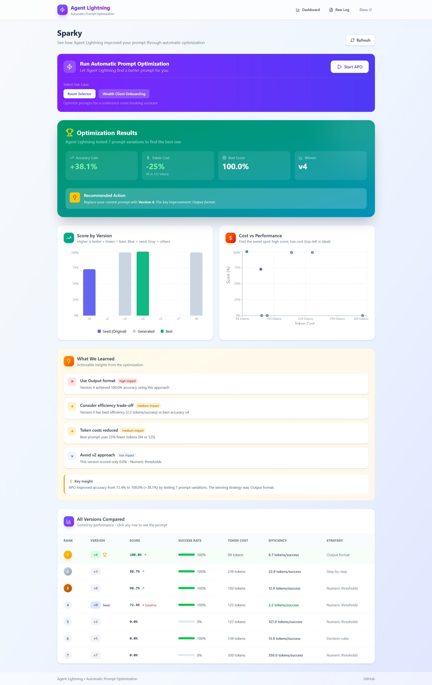

# ⚡ Sparky

**A visual dashboard for Agent Lightning's Automatic Prompt Optimization (APO)**

Sparky makes it easy to run, visualize, and understand prompt optimization for your AI agents.



---

## ✨ Key Features

- **One-Click APO** — Run automatic prompt optimization from the dashboard
- **Real-Time Results** — See accuracy gains, token costs, and winning prompts
- **Visual Comparisons** — Charts showing score by version & cost vs performance
- **Prompt Evolution** — View how prompts improved from seed to winner
- **Actionable Insights** — Get recommendations on what worked and what didn't

---

## 🚀 Quick Start

### Prerequisites

- Python 3.10+
- Node.js 18+
- Azure OpenAI API key (or OpenAI API key)

### 1. Set Environment Variables

```bash
cp .env.example .env
# Edit .env with your API keys:
# AZURE_OPENAI_ENDPOINT=https://your-endpoint.openai.azure.com/
# AZURE_OPENAI_API_KEY=your-key
```

### 2. Start Backend

```bash
cd backend
pip install -r requirements.txt  # if needed
uvicorn main:app --reload
```

### 3. Start Frontend

```bash
cd frontend
npm install
npm run dev
```

### 4. Open Sparky

```
http://localhost:5173
```

---

## 📖 Documentation

| Document | Description |
|----------|-------------|
| [APO_SECRET_SAUCE.md](APO_SECRET_SAUCE.md) | How APO works: textual gradients & beam search |
| [DEMO_SCRIPT.md](DEMO_SCRIPT.md) | 30-minute demo guide with talking points |
| [AGENT_LIGHTNING_FLOW.md](AGENT_LIGHTNING_FLOW.md) | Deep dive into how APO training works |
| [AGENT_LIGHTNING_CHECKLIST.md](AGENT_LIGHTNING_CHECKLIST.md) | Step-by-step checklist for new agents |
| [APO_SIMPLE_DEFINITIONS.md](APO_SIMPLE_DEFINITIONS.md) | Simple definitions: rollout, reward, datasets |
| [APO_FILES_EXPLAINED.md](APO_FILES_EXPLAINED.md) | How the example files work together |
| [INTEGRATION_GUIDE.md](INTEGRATION_GUIDE.md) | Framework-agnostic integration patterns |

---

## 📁 Project Structure

```
examples/apo/
├── backend/
│   ├── main.py                    # FastAPI server
│   ├── room_selector.py           # Room booking agent
│   ├── room_selector_apo.py       # APO training script
│   ├── wealth_onboarding_apo.py   # Wealth compliance agent
│   └── wealth_onboarding_data.json
├── frontend/
│   ├── src/pages/index.tsx        # Sparky dashboard
│   └── src/pages/log.tsx          # Raw log viewer
└── README.md
```

---

## 🎯 Use Cases Included

| Use Case | Description | Agent |
|----------|-------------|-------|
| **Room Selector** | Conference room booking assistant | `room_selector.py` |
| **Wealth Onboarding** | Bank KYC/AML compliance | `wealth_onboarding_apo.py` |

---

## ⚡ TL;DR

```bash
# Terminal 1: Backend
cd backend && uvicorn main:app --reload

# Terminal 2: Frontend  
cd frontend && npm run dev

# Open http://localhost:5173 and click "Start APO"!
```

---

## 📚 Learn More

- [Agent Lightning GitHub](https://github.com/microsoft/agent-lightning)
- [Agent Lightning Docs](https://microsoft.github.io/agent-lightning/)
- [APO Algorithm Guide](https://microsoft.github.io/agent-lightning/stable/algorithm-zoo/apo/)
